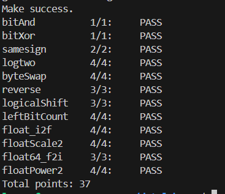

# datalab 报告

姓名：王宽

学号：2025201779

| 总分 | bitAnd | bitXor | samesign | logtwo | byteSwap | reverse | logicalShift | leftBitCount | float_i2f | floatScale2 | float64_f2i | floatPower2 |
| --------- | --------- | --------- | --------- | --------- | --------- | --------- | --------- | --------- | --------- | --------- | --------- | --------- |
| 37.00 | 1.00 | 1.00 | 2.00 | 4.00 | 4.00 | 3.00 | 3.00 | 4.00 | 4.00 | 4.00 | 3.00 | 4.00 |

test 截图：



## 解题报告

### 亮点

1. **byteSwap** —— 操作数上限只有 17，用"一次造掩码清两个字节"的做法压线通过。
2. **leftBitCount** —— 用算术右移加一进位来检测"高若干位是否全 1"，5 层二分无分支累加。
3. **float_i2f** —— 舍入到偶数的实现，以及尾数进位到 2^24 时的回绕处理。

### bitAnd

德摩根律：`x & y = ~(~x | ~y)`。3 个操作,属于例题，最容易的一道。。。

### bitXor

`x ^ y` 的含义是"至少有一个为 1，但不是都为 1"。第一次套用标准的异或公式显示运算符超额，然后用德摩根律把"至少一个为 1"写成 `~(~x & ~y)`，"不是都为 1"写成 `~(x & y)`。

### samesign

题目规定 0 既不是正数也不是负数，所以 (0, 0) 同号、(0, 非 0) 异号，需要单独处理。分三种情况穷举：
符号位比较用 `!(x >> 31 ^ y >> 31)`：算术右移会把符号位铺满全字，异或为 0 即同号。

### logtwo

等价于求最高位 1 的位置。用二分，课上讲的那种：依次判断值是否不小于 `2^16`、`2^8`、`2^4`、`2^2`、`2^1`，是就把对应的位权累加进结果，并把值右移相应位数继续判断。
### byteSwap

1. 算出两个字节各自的移位量 `ns = n << 3`、`ms = m << 3`，取出这两个字节；
2. 造一个掩码，把这两个字节原来的位置清零：`~((0xFF << ns) | (0xFF << ms))`；
3. 把取出的两个字节装到对方的位置上，与原值相或：`(x & mask) | (bn << ms) | (bm << ns)`。

### reverse

循环 32 次：每次把结果左移一位并接上输入的最低位，同时把输入右移一位。3 个操作。

循环变量写成递减形式 `for (i = 32; i; i--)`，因为 `<` 不在该题的合法运算符白名单里(这个我第一次还真卡了好久，还是问ai)

### logicalShift

`>>` 对 `int` 是算术右移，会把符号位复制到高位。所以需要一个掩码把多出来的高 `n` 位抹成 0。

`(1 << 31) >> n` 得到"高 `n` 位为 1"的算术移位结果，再 `<< 1` 补回最低位，取反即得"低 `32 − n` 位为 1"的掩码。

### leftBitCount

从最高位开始数连续的 1 的个数，用二分：每层判断最高的若干位是否全为 1，是就把层权累加并把 x 左移相应位数，让已计数的位移出。
这个题就和前面的思路差不多了

关键技巧是"高 k 位是否全为 1"的判定。因为 `>>` 是算术右移，若高 k 位全为 1，则 `x >> k` 恰好等于 `−1`，于是 `(x >> k) + 1` 进位为 `0`，取逻辑非得 1。写成

```c
s = !((x >> 16) + 1) << 4;   r += s;   x <<= s;
```

五层分别对应 16、8、4、2、1。最后一层之后只能数到 31，所以再单独补一次 `!(orign + 1)` 来处理 32 位全 1（即 `x = −1`，此时应返回 32）的情况。

### float_i2f
这道题开始是噩梦的开始了
1. `x == 0` 特判返回 0；
2. 拆出符号位，并对 `x` 取绝对值。取绝对值用 `~a + 1` 
3. 从高到低扫描，找出最高位 1 的位置 `e`；
4. 把 `a` 左移 `31 − e` 位，使最高位对齐到 bit 31，然后取高 24 位（隐含的 1 + 23 位尾数）和低 8 位（待舍入部分）；
5. 按"就近舍入、平局取偶"处理低 8 位：大于 `0x80` 进位，等于 `0x80` 时若尾数末位为 1 则进位；
6. 拼装。若第 5 步的进位使尾数变成 `2^24`，说明有效数字进位到了 2.0，需要把尾数右移一位、指数域加一（即再归一化一次）。

第 6 步的边界是本题的关键：正数中共有 127 个输入会触发这次回绕，漏掉就会整体差一倍（这个当时完全没想到，还是ai的帮助）

### floatScale2

`2 × f` 在位模式上就是把指数域加一。因为二进制的有效数字范围是 `[1, 2)`，乘 2 之后必然越界，重新归一化，所以直接 `uf + (1 << 23)` 即可。

三处例外需要单独处理：

| `exp` 域 | 处理 |
| --- | --- |
| `0xFF` | `±INF` 乘 2 仍是自身；`NaN` 按题目要求原样返回 |
| `0xFE` | 一定溢出，必须构造成 `±INF`（若简单加一，`frac` 非零会得到 `NaN`）|
| `0` | 没有隐含的 1，翻倍等于尾数左移一位，另外左移会丢掉符号位，需要单独补回 |

### float64_f2i
（最烧脑的一道题了属于是，纯ai辅助完成）
输入是 double 的高、低两个 32 位，输出是向零截断的 `int`。三步：

1. 从高 32 位取出符号位和 11 位指数域；
2. 把 53 位有效数字的高 32 位拼进一个 `unsigned`：最高位补上隐含的 1，接着是 `uf2` 中的高 20 位尾数（左移 11 位对齐），最后是 `uf1` 中的高 11 位尾数（右移 21 位）；
3. 右移 `1054 − exp` 位对齐到个位，得到绝对值的整数部分。

`1054` 的来源：拼出的值等于"有效数字 × 2^31"，而真实值是"有效数字 × 2^E"，两者相差 `2^(31−E)`；把 `E = exp − 1023` 代入即得移位量 `31 − E = 1054 − exp`。

两个边界：`exp < 1023` 时 `|值| < 1`，截断为 0（同时覆盖 ±0 和非规格化数）；`exp > 1054` 时一定溢出，返回 `0x80000000`（同时覆盖 `exp = 0x7FF` 的 `INF` 和 `NaN`）。

最后贴符号时必须区分：正数的上限是 `0x7FFFFFFF`，而负数的幅度可以到 `0x80000000`（即 `INT_MIN`），所以两条路的溢出判断阈值不同。

### floatPower2

返回 `2.0^x` 的位模式。因为 `2^x` 的有效数字恒为 1.0，`frac` 域恒为 0，所以规格化情况下只需要算指数域：

```
结果 = (x + 127) << 23
```

按 `x` 分四档：

| `x` 的范围 | 处理 |
| --- | --- |
| `x > 127` | 指数域会超过 254，返回 `+INF` |
| `-126 ≤ x ≤ 127` | 规格化，`(x + 127) << 23` |
| `-149 ≤ x ≤ -127` | 非规格化，`1 << (x + 149)` |
| `x < -149` | 比最小非规格化数还小，返回 0 |

非规格化档的公式：非规格化数的值为 `frac × 2^-149`，令其等于 `2^x` 得 `frac = 2^(x+149)`，而 `exp` 域为 0，所以位模式就是 `frac` 本身。

## 反馈/收获/感悟/总结

善用ai，善于总结课堂知识，多思考。

## 参考的重要资料

1. 《深入理解计算机系统》（CS:APP）第 2 章"信息的表示和处理"，第 2.4 节浮点数。
2. 课程课件 `2-machine.pdf`、`3-encoding.pdf`、`4-interger and float.pdf`。